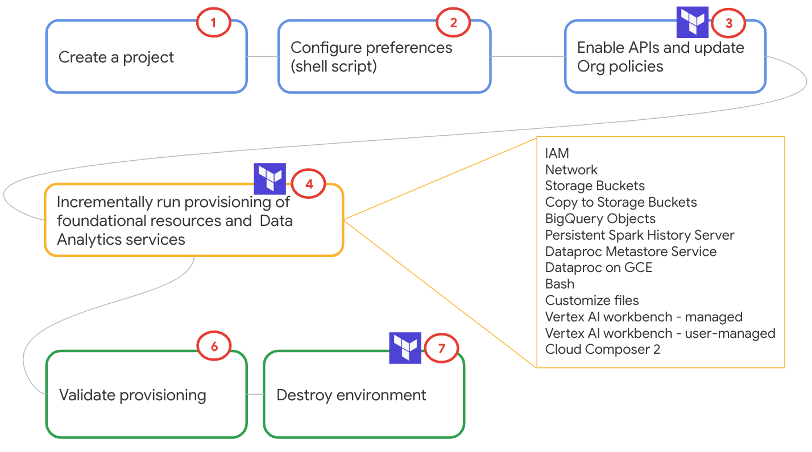

# Just enough Terraform for Data Analytics on GCP

## 1. About

This is a self paced hands-on lab that strives to demystify using Terraform to provision popular **Data Analytics** services on GCP. 

## 2. Target Audience
Terraform noobs

## 3. Duration
~90 minutes and then some to destroy the environment

## 4. Format
Self-paced, fully scripted, no research is required.  

## 5. Data Analytics Services Scope
The [modules listing](README.md#10-get-started-with-the-lab) below highlights services in scope. Its not all-encompassing. Contributions are welcome.

## 6. Prerequisites

Applicable for Google Customer Engineers, in Argolis- 
Grant yourself Organization Policy Administrator role from Cloud Console, at an Organization level 
Don't forget to set the project back to the project you created in Step 1 above in the UI.

## 7. Lab Goals
1. Understanding of core Terraform concepts
2. Knowledge of creating a set of Data Analytics services 
3. Terraform scripts that can be repurposed for your trails, PoCs, projects and such

## 8. Resources
Hashicorp docs: https://registry.terraform.io/providers/hashicorp/google/4.41.0  
Production hardened Terraform Blueprints: https://github.com/GoogleCloudPlatform/cloud-foundation-fabric  

## 9. Google Cloud Collaborator Credits

| # | Google Cloud Collaborators | Contribution  | 
| -- | :--- | :--- |
| 1. | Anagha Khanolkar | Vision, author |
| 2. | Rick Chen | Terraform expertise, feedback |
| 3. | Jay O' Leary | Testing and feedback |

## 10. Lab flow

   
  

## 11. Get started with the lab

The lab modules listed are best run sequentially to avoid dependency issues.  
Each module has an explanation of exactly what is covered, and covers one service at a time to make it bite-sized.

| # | Module | 
| -- | :--- | 
| 01 |  [Module-01: Setup Foundations](05-lab-guide/Module-01.md)| 
| 02 |  [Module-02: Enable Google APIs and update Organization Policies](05-lab-guide/Module-02.md)| 
| 03 |  [Module-03: Create user managed service account and grant IAM roles](05-lab-guide/Module-03.md)| 
| 04 |  [Module-04: Create Network, Subnet, Firewall rule(s), Reserved IP addreess, VPC peering, Router and NAT](05-lab-guide/Module-04.md)| 
| 05 |  [Module-05: Create Cloud Storage buckets](05-lab-guide/Module-05.md)| 
| 06 |  [Module-06: Upload objects to Cloud Storage](05-lab-guide/Module-06.md)| 
| 07 |  [Module-07: Create BigQuery objects](05-lab-guide/Module-07.md)| 
| 08 |  [Module-08: Create Dataproc Persistent Spark History Server](05-lab-guide/Module-08.md)| 
| 09 |  [Module-09: Create a Dataproc Metastore Service](05-lab-guide/Module-09.md)| 
| 10 |  [Module-10: Create a Dataproc Cluster on GCE](05-lab-guide/Module-10.md)| 
| 11 |  [Module-11: (Optional) Run a PySpark notebook on Dataproc Cluster on GCE on a BigLake table](05-lab-guide/Module-11.md)| 
| 12 |  [Module-12: (Optional) Run a Serverless Spark batch job](05-lab-guide/Module-12.md)| 
| 13 |  [Module-13: Run a shell script](05-lab-guide/Module-13.md)| 
| 14 |  [Module-14: Customize a file with Terraform](05-lab-guide/Module-14.md)| 
| 15 |  [Module-15: Provision Vertex AI Workbench Notebook instances](05-lab-guide/Module-15.md)| 
| 16 |  [Module-16: (Optional) Run a Python Notebook on the User Managed Notebook instance on Vertex AI Workbench](05-lab-guide/Module-16.md)| 
| 17 |  [Module-17: (Optional) Run a PySpark Notebook on the Managed Notebook instance on Vertex AI Workbench](05-lab-guide/Module-17.md)| 
| 18 |  [Module-18: Provision Cloud Composer](05-lab-guide/Module-18.md)| 
| 19 |  [Module-19: Other helpful Terraform commands](05-lab-guide/Module-19.md)| 
| 20 |  [Module-20: Running this lab in one shot](05-lab-guide/Module-20.md)| 

## 12. Dont forget to
Shut down the environment. [Module 19](05-lab-guide/Module-19.md) covers the same. 

## 13. Contributions welcome
Community contribution to improve the lab is very much appreciated.  

## 14. Getting help
If you have any questions or if you found any problems with this repository, please report through GitHub issues.

